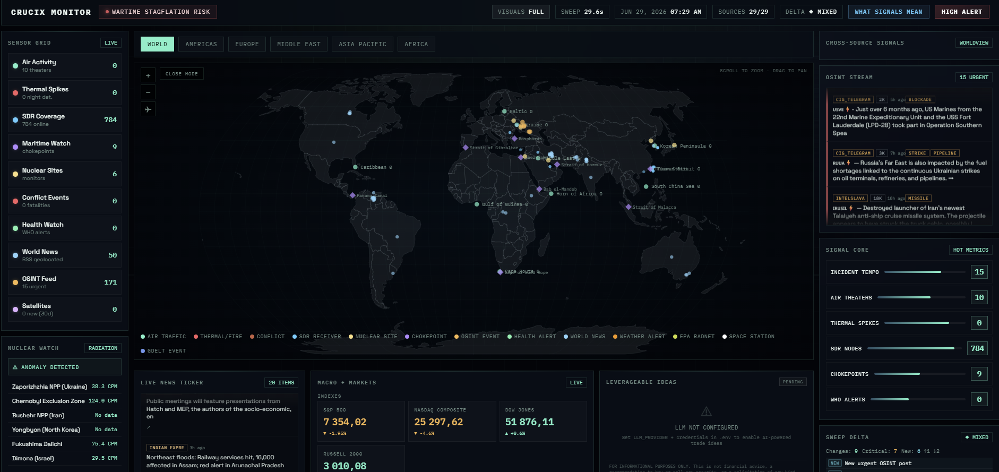

# Misc

## autoarxiv

Turn any paper into running code (https://arxiv.org/abs/2606.25996 -> https://autoarxiv.org/abs/2606.25996), Just swap arxiv → autoarxiv in the paper url. Outil d'alphaXiv, dans l'écosystème OpenResearch (agents de recherche gérés).

Why is it interesting?
- the principle of replacing just a part of an url to activate something else
- reproductibilité en un changement d'URL : de « un week-end de debug » à une repro *minimale* (petit modèle, moins d'étapes, 1 GPU au lieu d'un cluster), live et loggée, avec estimation du coût d'une repro complète.

### Resources

- alphaXiv : https://www.alphaxiv.org/
- autoarxiv : https://autoarxiv.org/
- Écosystème OpenResearch (managed research agents) : https://openresearch.sh/
- Source (post X, Akshay Pachaar) : https://x.com/akshay_pachaar/status/2068672842733109327

### Takeaway

"That hands the paper to an AI agent from alphaXiv. It reads the abstract, the claims, and the linked GitHub repo, then clones the codebase and works through the usual setup pain like dependencies, broken paths, environment config, and hardware assumptions.
From there it designs a minimal reproduction. That means a smaller model, fewer steps, and a single GPU instead of a cluster, scaled down just enough to test whether the headline claim holds.
The whole run is live and fully logged. Loss curves, metrics, and training progress are all observable as it happens.
What comes back is a clean signal on whether the minimal run matches the paper's reported result, plus an estimate of what a full replication would cost in compute and time.
A lot of research code dies in setup before anyone verifies a single number. This moves reproduction from a weekend of debugging to a url change."

### Questions

- Repro minimale automatique : la transposer à la vérification de claims bibliométriques/patrimoniaux (rejouer sur nos données une méthode décrite dans un article) ?
- La convention « URL-swap → agent » : la généraliser pour router une notice / un DOI vers un agent d'enrichissement (cf. idée URL-swap du 2026-07-31) ?

### Random Connections

- Idée « URL-swap : chaque permalien devient une porte d'entrée d'agent » (Ideas/ideas_2026-07-31.md) : autoarxiv en est le cas fondateur.
- AgentENV / Orca (agentic.md) : autoarxiv = repro isolée à l'échelle d'un papier ; AgentENV industrialise l'exécution, Orca met des essais en concurrence.
- Colibri / AirLLM (llm.md) : « repro minimale = petit modèle, 1 GPU » rejoint la frugalité d'inférence.
- claim-delta-radar : vérifier si un claim tient = brique de veille sur la validité des résultats.

---

## OSINT platforms

Open Source Intelligence data (geopolitical, news, financial, satelliets, networks...) aggregated in real time

Why is it interesting?
- Very pretty and real-time informative platforms

### Resources

- Crucix: https://github.com/calesthio/Crucix (Crucix live: https://www.crucix.live/)

- Shadowbroker: https://github.com/bigbodycobain/shadowbroker
- Flowsint https://www.flowsint.io/: knowledge graph from connected OSINT tools
- Shadowbroker https://github.com/bigbodycobain/shadowbroker: Shadowbroker pulls 60+ live intelligence feeds onto one map, then lets an AI agent work all of it through a single channel instead of wiring up each feed separately.
  The agent reads every layer and runs the lookups itself. The risky queries stay on the server, so your browser never holds the keys or reaches outside APIs directly.
  Self-hosted OSINT dashboard that aggregates 60+ live intelligence feeds onto one map, with a signed agent command channel over the same recon backends. 

### Takeaway

### Questions

- Same kind of data dashboard for library pilotage (problem is getting real-time data, but some possible: API HAL, API Affluence for public entries, etc...)?
- LLM inference?

### Random Connections

---

## Blockchain, Ethereum, dApps, Polygon wallet

Why is it interesting?
- Don't know precisely, I feel there can be some unexplored connections with LLM (inference, training, RAG...) or embeddings models

### Resources

- Introduction technique aus dApps: https://ethereum.org/fr/developers/docs/dapps/
- Qu'est-ce qu'uen application decentralisée?: https://www.kraken.com/fr-fr/learn/what-is-a-decentralized-application-dapp

### Takeaway

### Questions

### Random Connections

---

